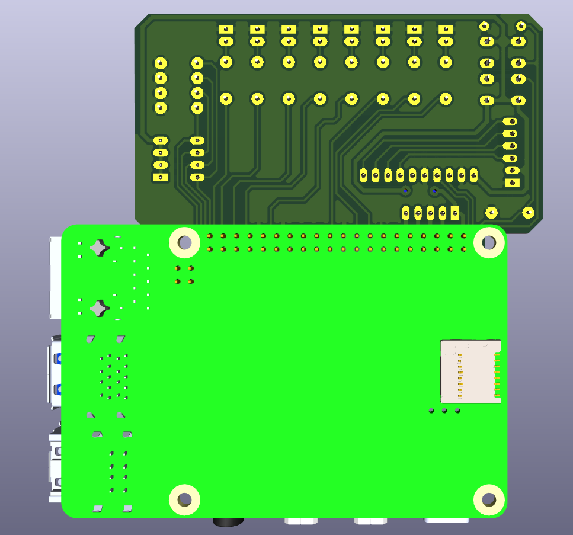
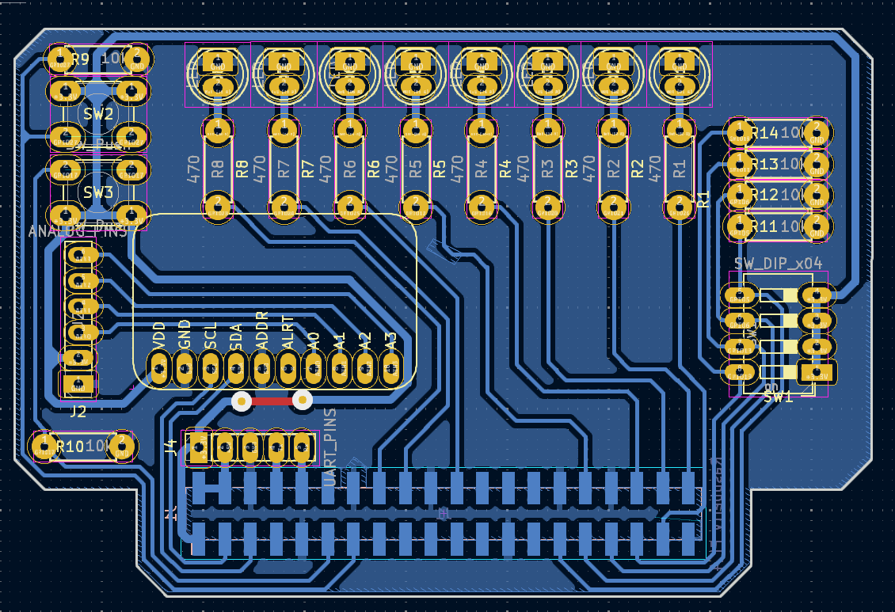
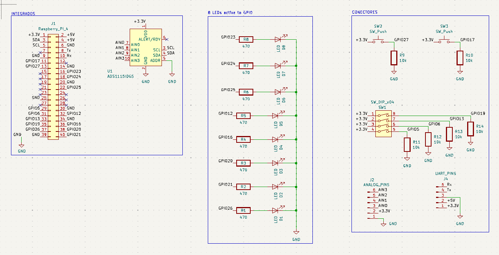

# RPI_AUX_BOARD_TDII

## Description:
This is an auxiliary board designed to be mounted on Raspberry Pi models 3, 3 B+, 4 B, and 5. It includes LEDs, buttons, and a DIP switch to facilitate GPIO management.

For ADC functionality, I recommend using the ADS1115.

This board is particularly useful for carrying out practical work related to the subject *Técnicas Digitales II* (TDII) in 2024.

## Images:
### Down View (3D Model)

### Lateral View (3D Model)

### PCB Design

### Schematic Design

### Up View (3D Model)

## Credits:
Developed by Matías Mollecker.

